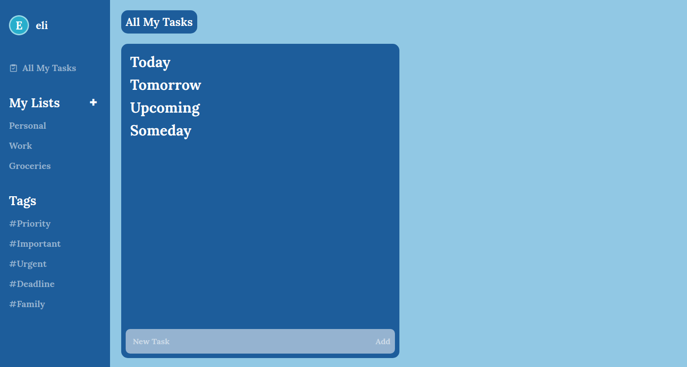
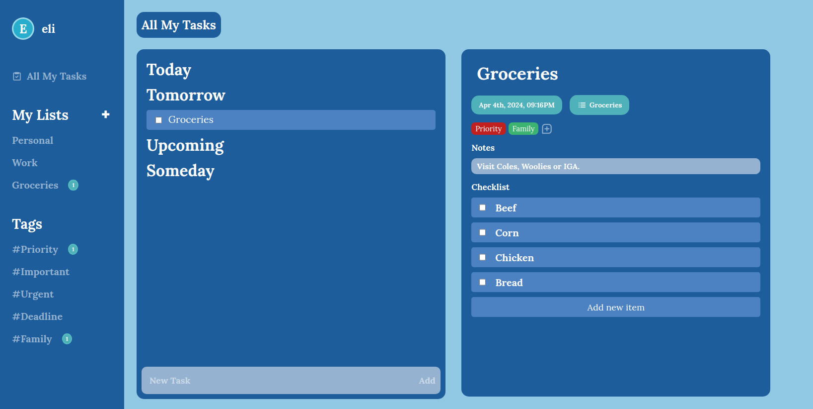
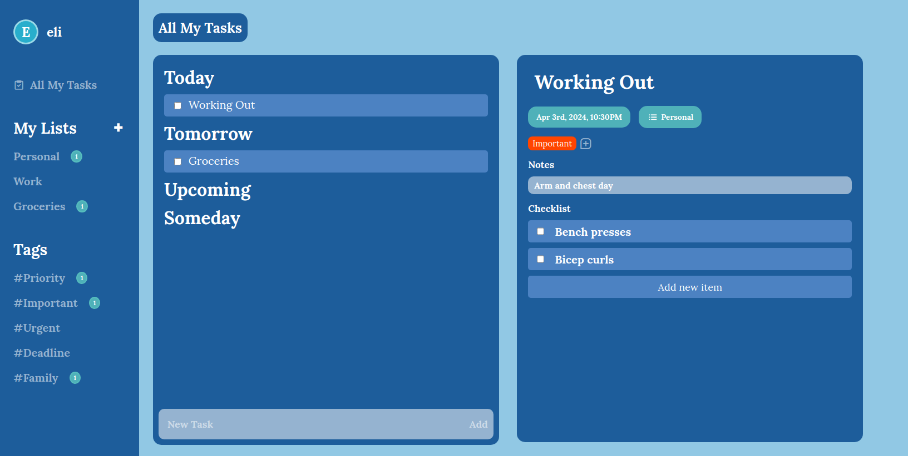

# To-Do App (WIP)

## About
- A minimal To-Do List application written in HTML/CSS and Vanilla JavaScript.
- Users are directed to a 'Home' page, where new to-do tasks can be added or ticked off. Additionally, users are able to create new Lists as well.
- Additional features such as remind me, change list, add/remove tags, notes, and a checklist were added for each To-Do instance.

## Screenshots

### Homepage


### Groceries task


### Workout task


### Instructions

- Fork repo and run the following commands in the terminal:

    **Install dependecies**

    ```
    npm install
    ```

    **Run app in browser**
    ```
    npm run dev
    ```

