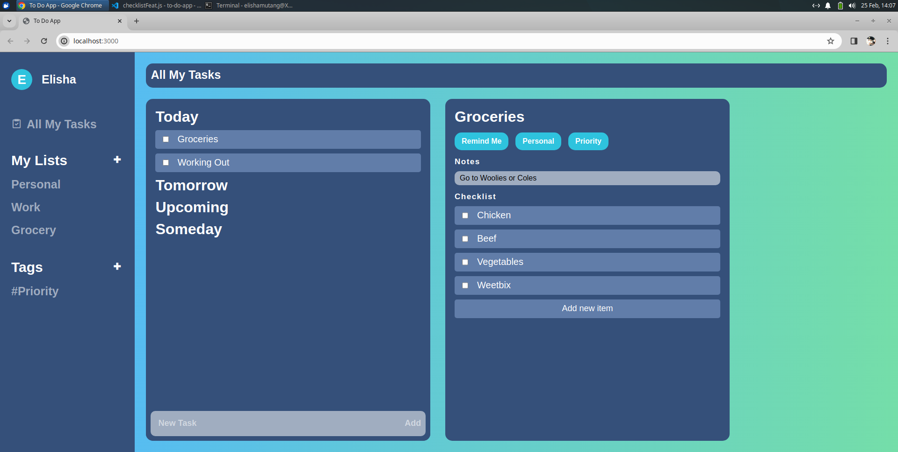
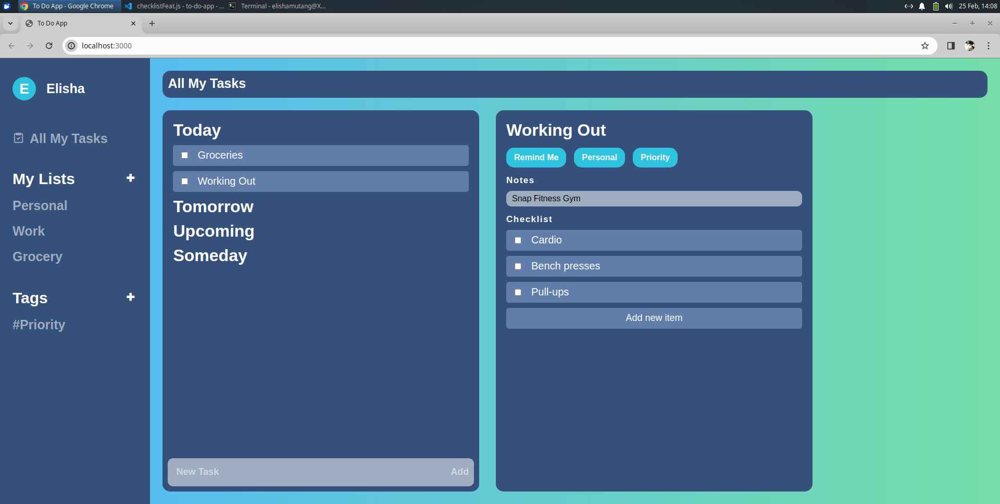

# To-Do App (WIP)

## About
- This project from The Odin Project focuses on the usage of Objects, DOM manipulation, NPM and Webpack (for bundling).

## Screenshots





## Disclaimer
- This project is currently a WIP, currently at 75% completion.
- To test out this To-Do App, refer to the sections below.

### Fork repo, install dependencies

- Fork repo and run the following commands in the terminal:

    **Install dependecies**

    ```
    npm install
    ```

    **Run app in browser**
    ```
    npm run dev
    ```

